# Aplikasi Peminjaman Kendaraan & Ruangan

Aplikasi web untuk mengelola peminjaman kendaraan dan ruangan instansi, mencakup pengajuan peminjaman, persetujuan admin, pencatatan otomatis tanggal peminjaman/pengembalian, hingga penerbitan Berita Acara digital.

**Instansi:** BPK Perwakilan DIY (Magang — Data Visualisasi / Data Analyst Support)
**Peran saya:** System Analyst — merancang alur sistem, struktur peran pengguna, dan menyusun buku panduan penggunaan aplikasi

> ⚠️ **Catatan Keamanan**
> Aplikasi ini telah ditanam di server internal instansi. Oleh karena itu, **kredensial login, data pribadi pegawai (nama & NIP), dan dokumen Berita Acara asli tidak ditampilkan** di repositori ini. Hanya alur kerja dan tampilan antarmuka umum yang didokumentasikan.

---

## Peran Saya sebagai System Analyst

- Merancang alur sistem multi-role: **User (Pegawai)**, **Admin Kendaraan**, **Admin Ruangan**, dan **Super Admin**
- Menentukan struktur navigasi dan hak akses tiap peran
- Merancang alur persetujuan peminjaman & pengembalian (pengajuan → menunggu persetujuan → disetujui/ditolak → Berita Acara otomatis)
- Menyusun buku panduan penggunaan aplikasi secara lengkap untuk seluruh peran pengguna

---

## Ringkasan Alur Sistem

**Sisi User (Pegawai):**
1. Registrasi & login akun
2. Memilih modul Peminjaman Ruangan atau Peminjaman Kendaraan
3. Melihat katalog & detail unit yang tersedia
4. Mengisi form peminjaman (tanggal pinjam, tanggal kembali)
5. Menunggu persetujuan admin terkait
6. Menerima notifikasi hasil persetujuan
7. Mengajukan pengembalian setelah selesai digunakan

**Sisi Admin Kendaraan / Admin Ruangan:**
- Dashboard ringkasan (total unit, unit dipinjam, unit tersedia)
- Grafik tren peminjaman mingguan & bulanan
- Persetujuan/penolakan permintaan peminjaman & pengembalian
- Kelola data unit (tambah/edit/hapus kendaraan atau ruangan)
- Laporan mingguan & bulanan (dapat diunduh sebagai CSV)

**Sisi Super Admin:**
- Dashboard menyeluruh (total user, total ruangan, total kendaraan, total peminjaman)
- Kelola data user & hak akses (role)
- Akses cepat ke dashboard Admin Ruangan & Admin Kendaraan
- Melihat seluruh riwayat peminjaman lintas kategori

---

## Tampilan Aplikasi

### Alur User (Pegawai)

| Login | Register |
|---|---|
| 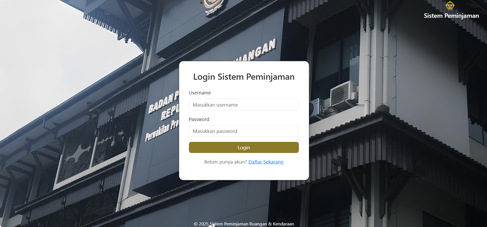 | 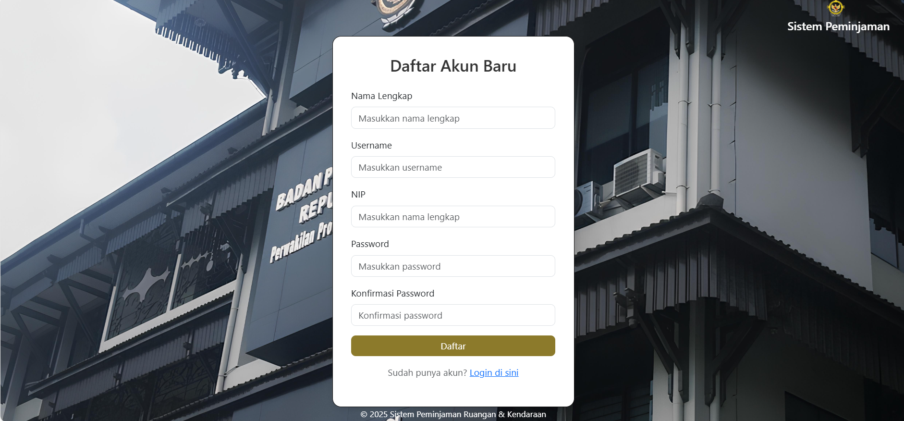 |

| Menu Peminjaman Ruangan | Menu Peminjaman Kendaraan |
|---|---|
| 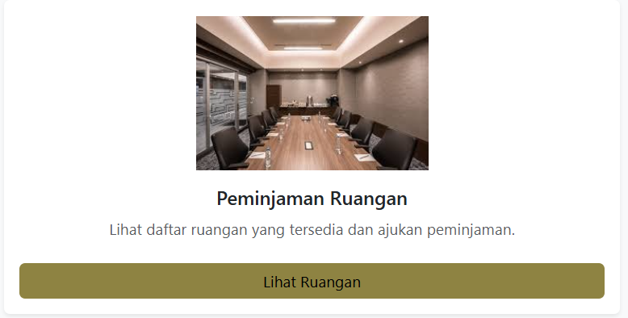 | 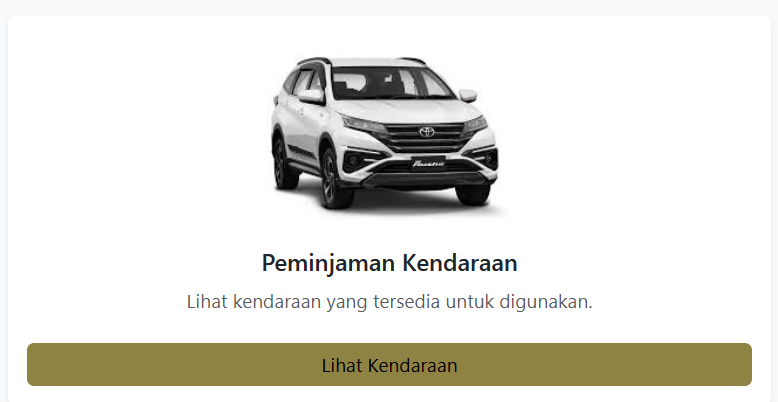 |

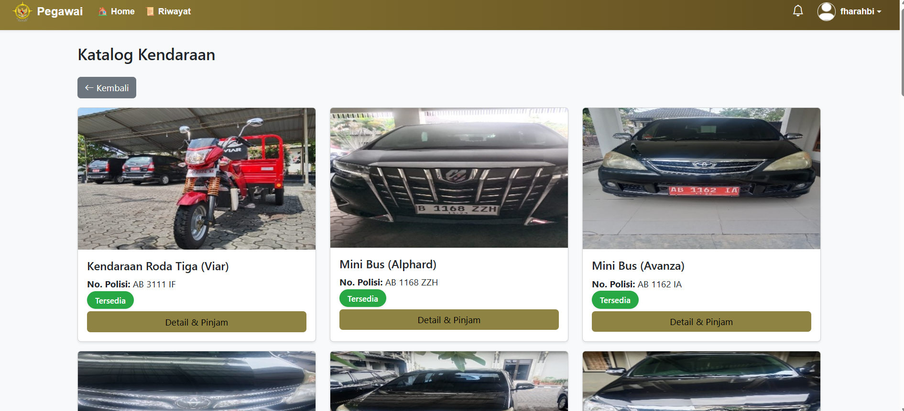
*Katalog kendaraan yang tersedia untuk dipinjam.*

| Detail Kendaraan | Form Peminjaman Kendaraan |
|---|---|
| 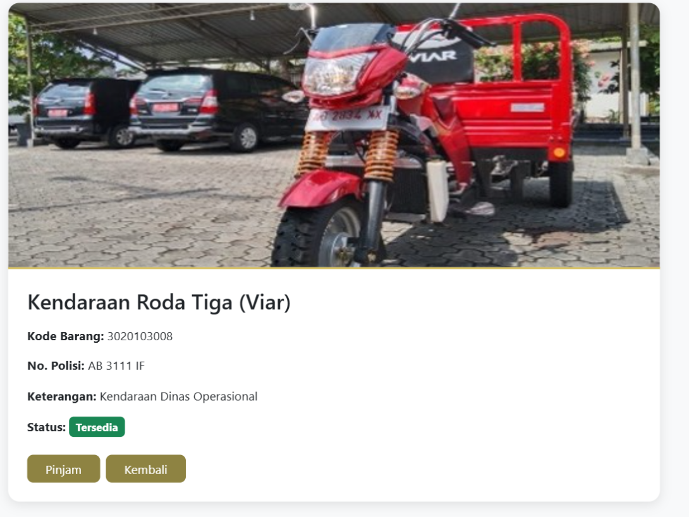 | 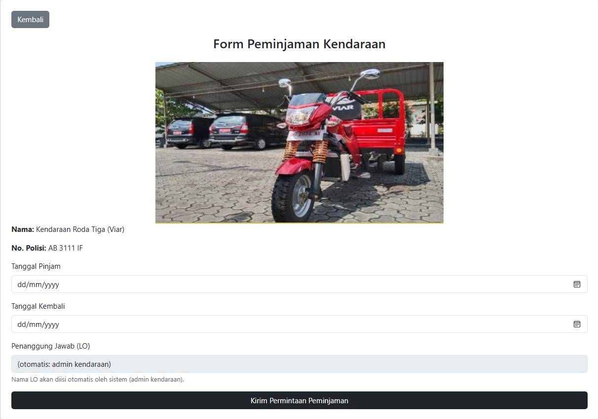 |

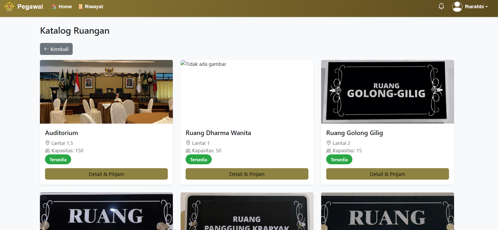
*Katalog ruangan yang tersedia untuk dipinjam.*

| Detail Ruangan | Form Peminjaman Ruangan |
|---|---|
| 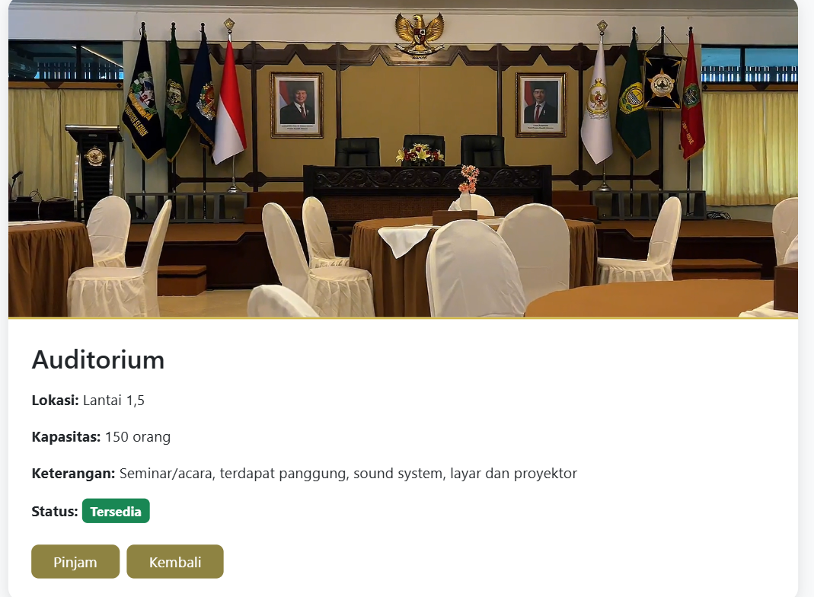 | 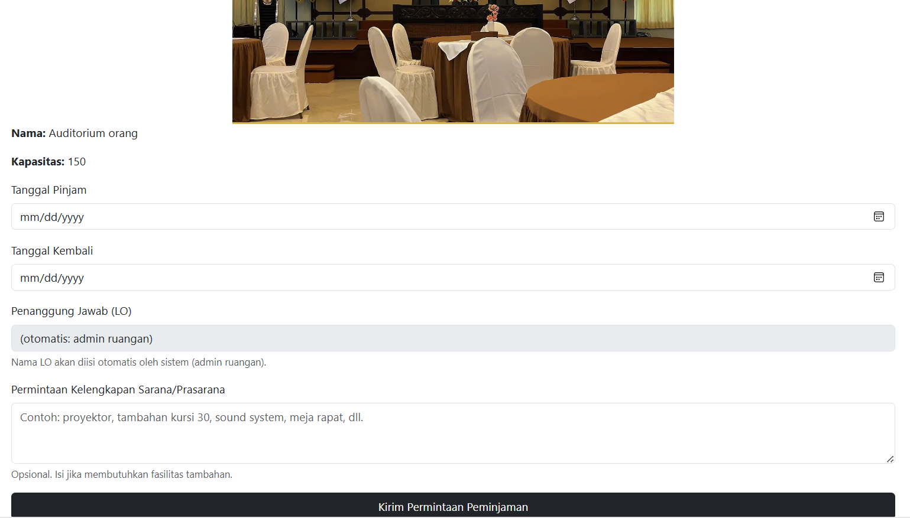 |

### Alur Admin Kendaraan

| Statistik Kendaraan | Grafik Tren Peminjaman |
|---|---|
| 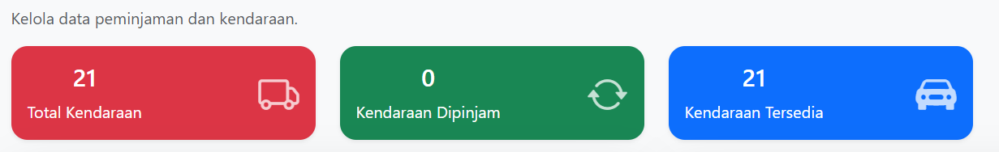 | 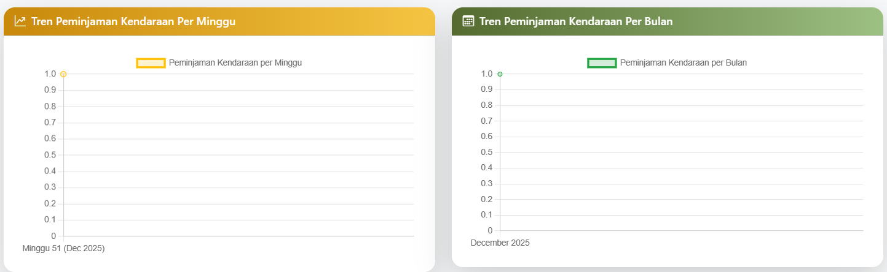 |

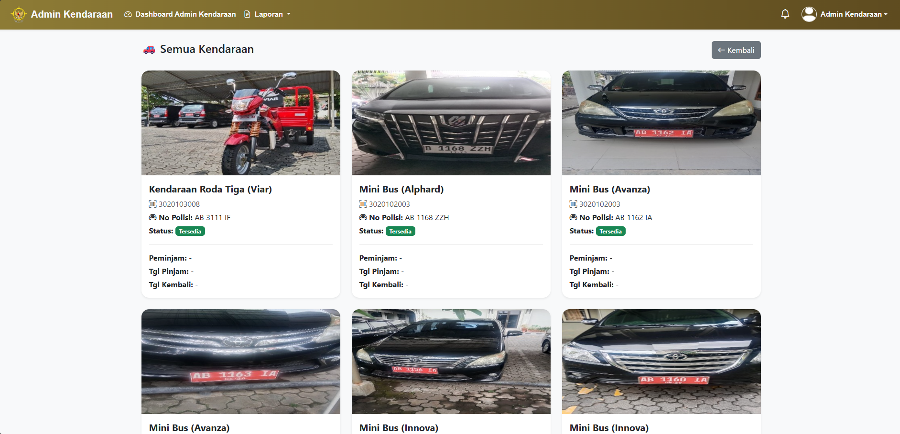
*Daftar seluruh unit kendaraan beserta status ketersediaannya.*

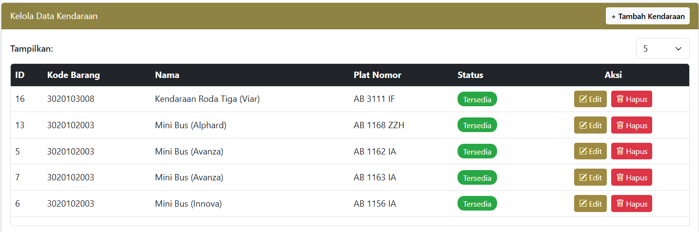
*Kelola data inventaris kendaraan (bukan data pengguna).*

### Alur Admin Ruangan

| Statistik Ruangan | Grafik Tren Peminjaman |
|---|---|
| 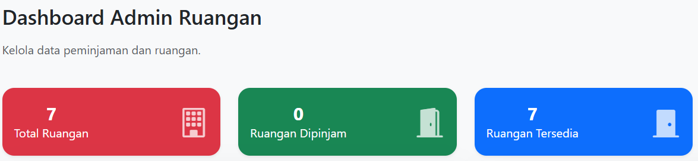 | 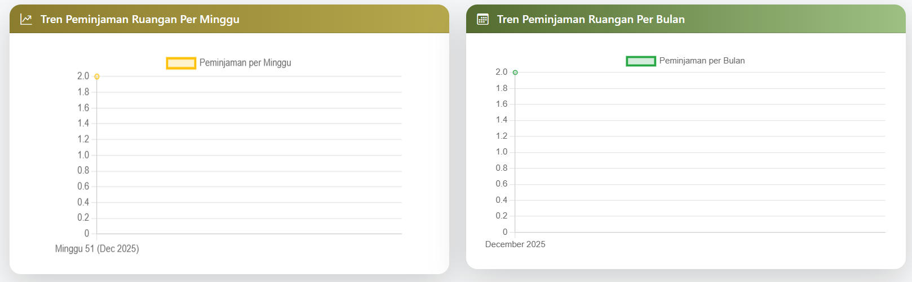 |

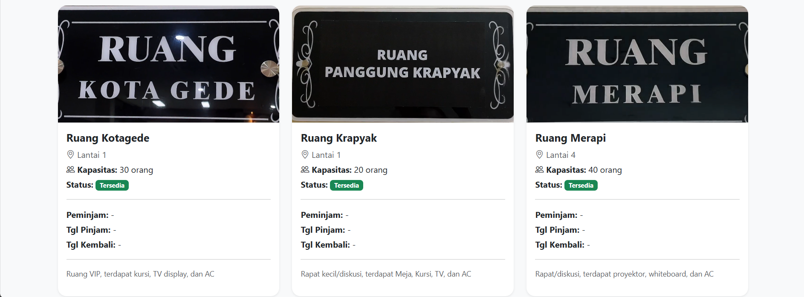
*Daftar seluruh ruangan beserta status ketersediaannya.*

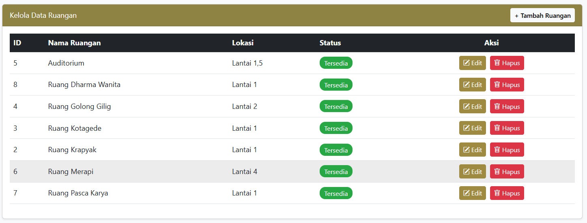
*Kelola data inventaris ruangan.*

### Alur Super Admin

| Dashboard Ringkasan | Aksi Cepat |
|---|---|
| 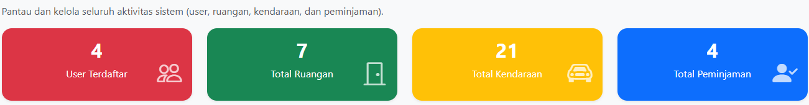 | 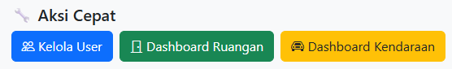 |

---

## Insight & Pembelajaran

Melalui proyek ini saya belajar merancang sistem dengan banyak peran pengguna sekaligus (4 role berbeda dengan hak akses masing-masing), termasuk alur persetujuan bertingkat dan penerbitan dokumen otomatis (Berita Acara). Saya juga belajar pentingnya menjaga keamanan data saat sebuah aplikasi internal instansi didokumentasikan untuk kebutuhan di luar organisasi.

---

## Kontak
Synthia Wulandari — [synthiawln@gmail.com](mailto:synthiawln@gmail.com) · [LinkedIn](https://www.linkedin.com/in/synthia-wulandari)
